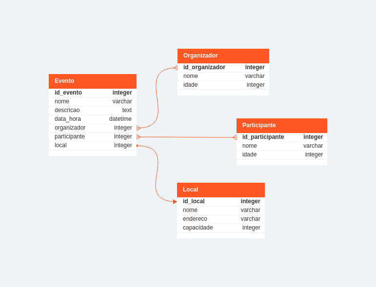

# Agenda de Eventos

> Se os comandos derem errador usando "py" tente outros como "python" e "python3"

## Crie e ative seu ambiente virtual

```bash
py -m venv .venv
.venv/Scripts/activate
```

## Instalando dependências

```bash
pip install -r requirements.txt
```

## Rodando o servidor em localhost 8000

```bash
py manage.py runserver
```

## Diagrama


